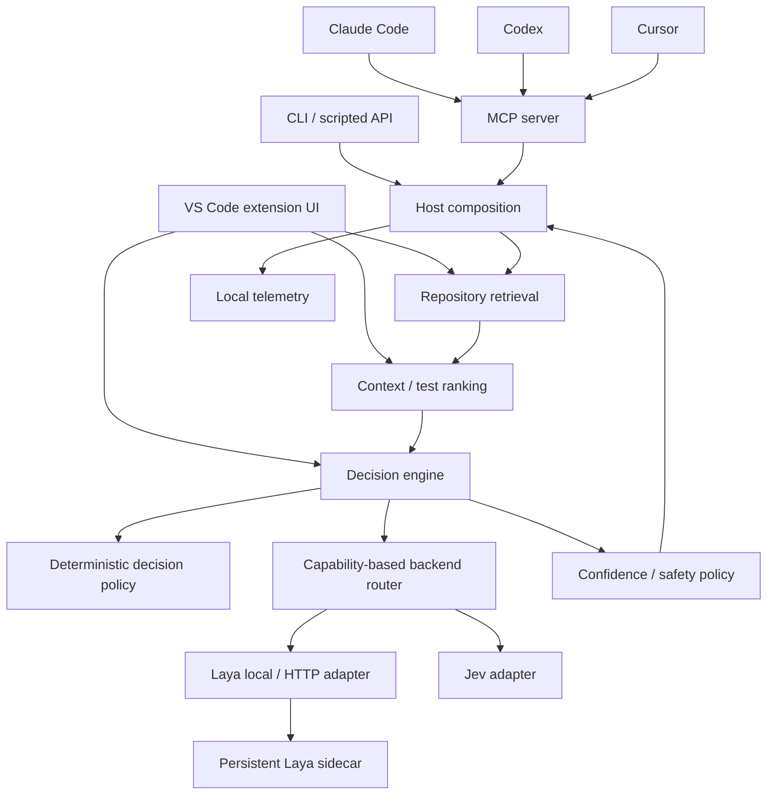
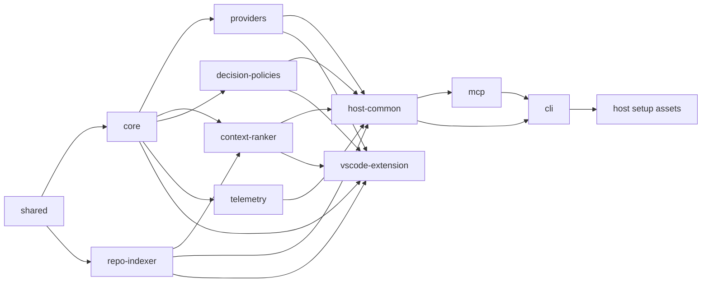
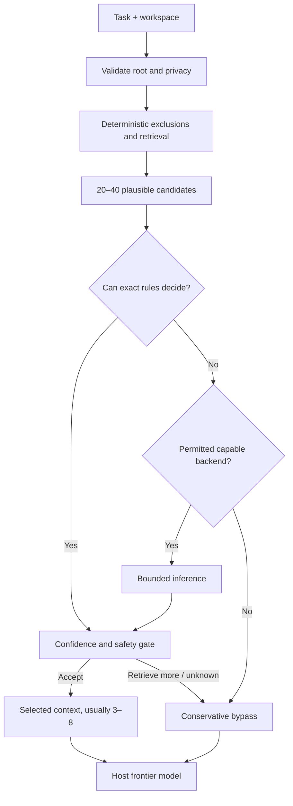

# ThinkTrim architecture

Status: architecture baseline. The current VS Code extension composes the implemented shared packages directly; `host-common` remains a planned shared composition layer. This document does not claim that host APIs can intercept internal agent behavior.

## Runtime shape

The host adapter invokes retrieval before exposing selected context to a frontier host where the host gives it that opportunity. MCP calls are agent-invoked, so their savings depend on the agent using `thinktrim_context` before broad file reads. This is a measurable adoption condition, not an implicit interception feature.

## Package and directory boundaries

| Path                         | Responsibility                                                                                                                                                                                       | Dependencies allowed                                                                           |
| ---------------------------- | ---------------------------------------------------------------------------------------------------------------------------------------------------------------------------------------------------- | ---------------------------------------------------------------------------------------------- |
| `packages/shared`            | Small stable JSON-safe primitives, IDs, schema versions, errors, hashing interfaces. No orchestration.                                                                                               | Standard library only                                                                          |
| `packages/core`              | `DecisionRequest`, `DecisionResult`, `DecisionBackend`, `DecisionEngine`, `BackendCapabilities`, `DecisionPolicy`, `ConfidencePolicy`, `DecisionTrace`; backend-neutral engine.                      | `shared`                                                                                       |
| `packages/providers`         | Laya local/HTTP and Jev adapters, transport, parsing, health, deadlines. No ranking or policy thresholds.                                                                                            | `core`, `shared`                                                                               |
| `packages/repo-indexer`      | Ignore-aware discovery, safe file metadata, symbols/imports, lexical/structural retrieval, incremental index. No inference.                                                                          | `shared`                                                                                       |
| `packages/context-ranker`    | Candidate feature construction, bounded ranking strategies, test candidate reranking, stable ordering. Consumes repository retrieval and calls an injected `DecisionEngine`; never names a provider. | `core`, `shared`, `repo-indexer`                                                               |
| `packages/decision-policies` | Deterministic resolvers, risk rules, confidence calibration and safe/balanced/aggressive profiles.                                                                                                   | `core`, `shared`                                                                               |
| `packages/telemetry`         | Local trace sink, usage accounting, aggregation, opt-in export interface. No source logging by default.                                                                                              | `core`, `shared`                                                                               |
| `packages/host-common`       | Composition root: workspace scoping, configuration, backend registration/order, retrieval-to-ranking workflows, setup transaction helpers.                                                           | The packages above                                                                             |
| `packages/mcp`               | Compact MCP tool schemas, validation, request/response conversion, stdio server.                                                                                                                     | `host-common`, `shared`                                                                        |
| `packages/cli`               | `thinktrim` commands, including MCP launch and host setup/doctor.                                                                                                                                    | `host-common`, `mcp`                                                                           |
| `services/laya-sidecar`      | Persistent Python runtime using supported Laya APIs; local IPC protocol and health lifecycle.                                                                                                        | Laya Python dependency; no TS package import                                                   |
| `apps/vscode-extension`      | VS Code commands, settings, session trace, status, SecretStorage, local index/ranking UI, and provider connection checks.                                                                            | `core`, `context-ranker`, `repo-indexer`, `decision-policies`, `providers`, `shared`, `vscode` |
| `integrations/claude-code`   | Claude setup templates and checks; no separate decision engine.                                                                                                                                      | `host-common` or CLI installer assets                                                          |
| `integrations/codex`         | Codex setup templates and checks; no separate decision engine.                                                                                                                                       | `host-common` or CLI installer assets                                                          |
| `integrations/cursor`        | Cursor setup templates and checks; no separate decision engine.                                                                                                                                      | `host-common` or CLI installer assets                                                          |

These are **ownership boundaries**, not a requirement to publish eleven npm packages immediately. Keep `integrations/*` as configuration assets until host-specific code is justified. Do not add an `integrations/vscode` duplicate: `apps/vscode-extension` owns VS Code integration. `benchmarks/`, `datasets/`, and `tests/` are later workspaces, not runtime layers.

Arrows mean “is imported by.” `core` imports no provider, indexer, VS Code, host SDK, or concrete policy package. `context-ranker` calls the engine through its interface; the engine has no ranking-specific import, avoiding a cycle. The Python sidecar uses a versioned wire protocol rather than a package import.

## Workflows and invariants

1. `host-common` validates workspace root, task, privacy settings, budget, and caller limits.
2. `repo-indexer` applies safe hard exclusions and deterministic retrieval. Explicitly named files may bypass relevance exclusions, but never binary, unsafe-path, or size guards. Preserve provenance and stable IDs.
3. `context-ranker` builds short features and chooses an evaluated strategy (binary, scoring, choice, pairwise, or listwise). Default strategy remains deterministic until benchmark evidence supports inference for a category.
4. `core` runs exact policy rules, cache lookup where safe, capability-aware backend selection, bounded inference with deadline, response validation, and confidence/safety policy. No backend is selected if its locality violates the request's egress policy.
5. A usable result includes ranked IDs, score provenance, confidence calibration status, and an outcome: accept, reject, retrieve_more, escalate, or unknown. The caller receives conservative candidates if ranking fails.
6. `telemetry` receives redacted structured events. The host controls what selected content it reads or forwards. ThinkTrim never executes tests, retries, or source edits as a consequence of a probabilistic result alone.

## Data, latency, and lifecycle

- Source content stays out of the persistent index by default except short summaries needed for retrieval; content fingerprints identify staleness. Indexing must honor `.gitignore`, size caps, binary detection, and workspace boundaries.
- Laya local uses a long-lived sidecar with health, version, capabilities, predict, optional batch predict, cancellation, and clean shutdown. Startup/restart is bounded; no per-decision Python process spawn. CPU/GPU selection and model acquisition are explicit configuration, not npm/VSIX payloads.
- Jev-specific authentication, endpoint, headers, limits, and response mapping remain in its adapter. Shared transport exists only for genuinely common semantics.
- Step 4 verified a common `/v1/systemone` HTTP question/answer shape for Laya's own HTTP server and TypeSafe Jev. The local Python sidecar has a distinct transport. See [provider architecture](PROVIDER_ARCHITECTURE.md) for the verified overlap and capability limits.
- Backend failures are typed (`unavailable`, `timeout`, `invalid_output`, `privacy_denied`, `cancelled`). Retry a provider only when safe and within a total deadline. Failover uses only explicitly configured permitted providers, then bypasses safely.
- Cache keys cover schema, category, normalized task, ordered candidate/content fingerprints, relevant working tree state, backend/model version, strategy, and policy version. Do not cache unsafe retries or insufficient-context verdicts without a verified invalidation model.

## Architecture critique

| Challenge                             | Assessment and response                                                                                                                                                                                                                                                                 |
| ------------------------------------- | --------------------------------------------------------------------------------------------------------------------------------------------------------------------------------------------------------------------------------------------------------------------------------------- |
| Premature abstraction?                | Eleven named packages are a map, not eleven immediate releases. `host-common` and `shared` should stay small; split only when ownership or dependency boundaries make the split useful. Strategy interfaces are justified by measurable alternatives, but implement one baseline first. |
| VS Code leaking into core?            | Dependency direction forbids it. No `vscode` types appear in `core` contracts. Secret storage and UI stay in the extension.                                                                                                                                                             |
| Other hosts without VS Code?          | Yes: MCP/CLI compose the same engine directly. Host setup assets do not load the extension.                                                                                                                                                                                             |
| New backend without changing ranking? | Yes: a `DecisionBackend` adapter advertises capabilities, locality, and schema version; ranking uses `DecisionEngine` only. Provider-specific prompts/output parsers remain in the adapter.                                                                                             |
| Deterministic preference?             | Exact rules, ignore-aware retrieval, lexical scoring, test candidate generation, and log normalization precede inference. Benchmarks must prove inference improves recall/quality per cost before it becomes default.                                                                   |
| Most serious residual risk?           | False negatives in context selection and false-positive sufficiency can degrade coding. Conservative fallback, must-include evidence, calibration, and task-level benchmarks are required before aggressive pruning.                                                                    |

See [DECISION_MODEL.md](DECISION_MODEL.md), [HOST_INTEGRATIONS.md](HOST_INTEGRATIONS.md), [SECURITY_MODEL.md](SECURITY_MODEL.md), [TOKEN_SAVINGS_MODEL.md](TOKEN_SAVINGS_MODEL.md), and ADRs for operational detail.
