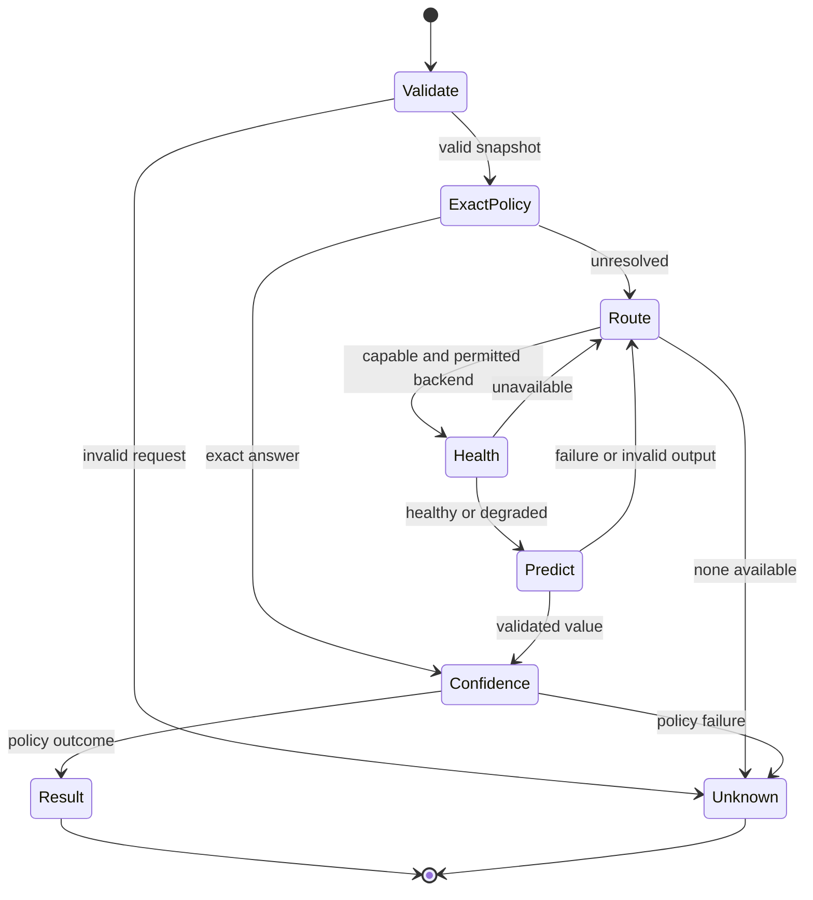

# Decision model and contracts

Status: Step 3 contracts and core engine implemented. The source of truth is `packages/core/src/types.ts`; this document explains the invariants and the policy hooks that later packages must supply.

## Typed requests and values

`DecisionRequest<K>` and `DecisionValue<K>` use maps keyed by four decision forms. A binary request may omit candidates. Choice, score, and ranking requests require a candidate set. Choice returns one candidate ID; score returns one bounded score per candidate; ranking returns a nonempty ordered subset. Classification options can be represented as choice candidates.

```ts
type DecisionKind = "binary" | "choice" | "score" | "ranking";
type DecisionOutcome = "accept" | "reject" | "retrieve_more" | "escalate" | "unknown";

interface DecisionBackend {
  readonly capabilities: BackendCapabilities;
  health(signal?: AbortSignal): Promise<BackendHealth>;
  predict<K extends DecisionKind>(
    request: DecisionRequest<K>,
    signal?: AbortSignal,
  ): Promise<BackendPrediction<K>>;
}

interface DecisionEngine {
  decide<K extends DecisionKind>(
    request: DecisionRequest<K>,
    signal?: AbortSignal,
  ): Promise<DecisionResult<K>>;
}
```

`DecisionCandidate.id` is a branded `CandidateId` from `@thinktrim/shared`. The factory validates it without changing it; the caller must make IDs stable within its workspace. Runtime validation rejects duplicate, blank, oversized, or control-character IDs. The engine takes a validated JSON snapshot before any asynchronous backend work, so later caller mutations cannot change candidate identity mid-decision.

Requests carry a bounded task, category, optional short evidence, candidates, a deadline, candidate/output budgets, a confidence profile, and declared data classes. `local_only` requires an empty remote allowance. A remote backend is eligible only when the request explicitly permits every declared data class. Host adapters remain responsible for classifying repository-derived data correctly.

## Outcomes and errors

`DecisionResult` contains an outcome, optional typed value, calibrated confidence or `null`, provenance, backend identity, optional backend usage, latency, an optional structured error, and a redacted `DecisionTrace`. The five outcomes mean:

| Outcome         | Caller meaning                                                                 |
| --------------- | ------------------------------------------------------------------------------ |
| `accept`        | Use the validated decision. Backend acceptance requires calibrated confidence. |
| `reject`        | Do not take the proposed bounded action.                                       |
| `retrieve_more` | Gather more evidence or candidates.                                            |
| `escalate`      | Ask the frontier host or user to reason further.                               |
| `unknown`       | No usable decision was obtained; continue normal host behavior.                |

Outcomes are assigned by `ConfidencePolicy`, not inferred from a binary boolean or a provider's largest probability. `DecisionPolicy` supplies exact deterministic answers and category-specific validation/risk. The engine validates these policy outputs and does not implement category-specific thresholds.

Errors use stable codes: `invalid_request`, `unsupported`, `privacy_denied`, `unavailable`, `timeout`, `cancelled`, `invalid_output`, `backend_failure`, and `policy_failure`. Error messages are fixed and do not include raw provider exceptions, credentials, task text, or source. A failed decision returns `unknown` with an error and no decision value. `DecisionTrace` records stage names, duration, reason codes, and backend IDs without payloads.

## Engine path



Capability routing checks schema, kind, category, input bytes, candidate count, and locality. Backends are tried in configured order within one total deadline. Health and prediction receive an `AbortSignal`; the engine also races them against cancellation so it returns promptly if an adapter ignores the signal. Timeout and external cancellation stop failover. Provider-specific transport and parsing stay outside core.

`BackendRouter` now exposes `plan(request, backends)`, and `CoreDecisionEngine.planRoute(request)` returns the same inspectable plan without invoking a backend. Requests may select `local`, `remote`, or `auto` mode, an exact backend ID, fallback permission, network state, local preference, language, and latency or quality preference. The router checks capabilities, input size, privacy permission, known availability, and explicit language support before ordering attempts. Latency and quality ranks are optional host-supplied relative hints, not measured or calibrated scores. Default routing preserves configured backend order. A named override is strict unless fallback is explicitly permitted; neither a mode nor an override can grant remote egress. The engine records skipped reasons and live health failures in its trace, then bypasses if no permitted backend succeeds.

`DecisionCache` is opt-in on `CoreDecisionEngine`. It uses a SHA-256 key over schema, category, routed backend ID/model/locality, workspace, policy version, repository state, and canonical request semantics. Request IDs and per-call deadlines are excluded; task whitespace is normalized while case and candidate order are preserved. A nonempty `repositoryState` is required, so source-informed decisions are bypassed when the caller cannot provide a state fingerprint. Hosts should include Git HEAD and relevant working-tree state in that fingerprint and call workspace invalidation after changes. The cache has bounded LRU capacity, TTL, `clear()`, workspace and model invalidation, and hit/miss/entry counters. It stores backend decisions only, skips failures, records cache hits in the trace, and treats cache errors as misses. The default in-memory cache does not persist across process restarts.

The engine validates response kind, candidate membership, uniqueness, score range and completeness, ranking output budget, usage, and metadata types. `FakeBackend` is a scripted backend for reusable contract and engine tests. No Jev or Laya behavior is in core.

## Confidence and context sufficiency

Deterministic answers carry `confidence: null` and deterministic provenance, rather than a fabricated probability of 1. Backend `rawSignal` is uncalibrated. A policy may publish a number only with `calibrated: true`; uncalibrated backend results cannot receive `accept`. `safe`, `balanced`, and `aggressive` profiles are request inputs.

`ProfileConfidencePolicy` provides the foundation for those profiles. `thresholdFor()` exposes a `provisional` value for each profile, decision kind, category, and risk level. Category and risk floors can raise the base kind threshold. All shipped threshold numbers are policy starting points; none is a measured false-positive or accuracy guarantee. By default there are no calibrators. A raw signal alone therefore returns `retrieve_more` for context decisions or `unknown` elsewhere, with null confidence. A caller may register a calibrator scoped to an exact backend ID, model version, category, and kind, with provenance identifying a held-out dataset, evaluation run, sample count, and calibrator version. Registration metadata is an assertion by the caller, not independent evidence verification by the library. For a binary false answer, the policy complements the provider's P(true) signal before calling the calibrator, so the input represents the emitted answer. The calibrator maps that signal to estimated probability of correctness; only valid calibrated output is compared to the provisional threshold. A model update or category change needs its own calibration. Benchmark and calibration work remains necessary before treating these thresholds as tuned.

Step 31 audited calibration readiness per decision type. The synthetic Step 30 suite found two top-three context pruning misses. Eight live Jev sufficiency decisions on synthetic cases yielded seven binary-labeled observations: five correct and two incorrect `insufficient` predictions. One `uncertain` gold case is retained in the report but excluded from binary metrics. The binary predicted-label signal had diagnostic Brier 0.232 and ECE 0.197. The sample is too small and is not an independent holdout, so all profile thresholds remain provisional and `balanced` is not the default. The readiness audit is in `evaluation/results/step31.json`.

`context-ranker` now compares deterministic retrieval with binary, scoring, small-group choice, pairwise, and listwise approaches using labeled fixtures. The deterministic baseline remains the default because the fixtures show no quality gain from simulated model strategies. Grouped score is the optional provider strategy: current adapters support it for at most 16 candidates per request, while native listwise ranking is unavailable. The policy preserves the full deterministic ordering if any group is unaccepted, uncalibrated, or fails. It reports `confidence: null` unless every group has calibrated confidence from the same backend. Context sufficiency requires especially strong evidence for `sufficient`; uncertain outcomes permit more retrieval. Test ranking narrows fast development loops but never replaces full CI. Retry safety rules override probabilistic scores.

`ContextSufficiencyPolicy` in `decision-policies` records retrieved evidence IDs, sources, and fingerprints. Missing required evidence or known open questions yield `insufficient`. Empty or unstated coverage, backend failure, unaccepted results, and low or uncalibrated confidence yield `uncertain`. Both set `continueSearch: true`. Only an accepted, calibrated backend binary decision meeting the configured floor (default 0.95) can yield `sufficient`. This floor is a guardrail, not a measured calibration result; host composition must supply a calibrated confidence policy and current evidence fingerprints before using a sufficient verdict to stop retrieval.

Caching is not implemented in Step 3. Future entries must include schema, category, normalized task and candidate/content fingerprints, repository state, backend/model/prompt version, policy version, and TTL. Never cache secrets or unsafe retry recommendations.
