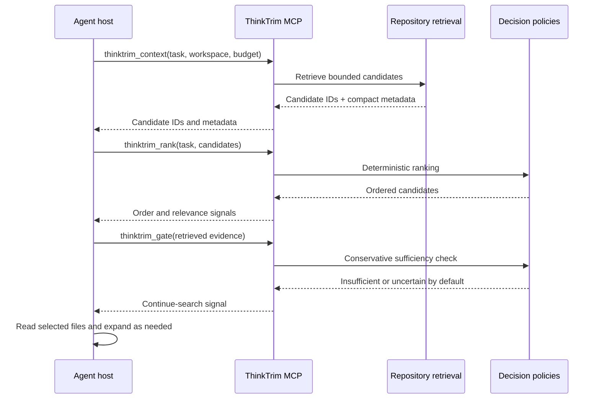

# Host integrations

Status: V1 MCP tools, Claude Code/Codex/Cursor project setup, and the VS Code command and metrics UI are implemented. Host setup syntax and capabilities are version-sensitive; verify the linked official documentation again during future integration changes.

## Portable boundary

The primary portable surface is a local `thinktrim mcp` stdio server. It exposes four compact tools:

| Tool                 | Purpose                                                            | Output                                                               |
| -------------------- | ------------------------------------------------------------------ | -------------------------------------------------------------------- |
| `thinktrim_context`  | Retrieve indexed file candidates from a bounded task query.        | IDs, paths, compact descriptions, matched terms, truncation          |
| `thinktrim_rank`     | Rank retrieved files using deterministic context policy signals.   | ordered files, relevance, uncalibrated confidence marker             |
| `thinktrim_gate`     | Assess retrieved evidence against required IDs and open questions. | sufficient/insufficient/uncertain, continue-search flag, reason code |
| `thinktrim_classify` | Normalize and classify a bounded terminal excerpt.                 | failure category, source, diagnostic evidence                        |

Tool input accepts no shell commands. A workspace path is resolved against an approved root; tool results never include arbitrary full files by default. Schemas and descriptions must stay short because they enter host context. `outcome=retrieve_more` or `unknown` tells the agent to continue normal retrieval/reasoning. MCP tool calls are voluntary host actions; installation alone cannot guarantee pre-read pruning.

## Claude Code, Codex, Cursor

All three use the same MCP server. The CLI owns host configuration merges; each `integrations/<host>` directory owns setup documentation and any host-specific checks. `thinktrim setup claude|codex|cursor` inspects existing configuration, previews the exact edit, merges a named ThinkTrim entry, preserves unrelated entries, writes atomically where possible, and validates the resulting file. `--dry-run` never writes. `thinktrim uninstall <host>` removes only ThinkTrim-owned entries and preserves user changes.

- **Claude Code:** MCP is the baseline. `thinktrim setup claude` writes a project `.mcp.json` entry and uses `CLAUDE_PROJECT_DIR` to scope indexing. `CLAUDE.md`, hooks, commands, and skills are left untouched because the compact MCP descriptions provide the V1 tool guidance. Claude Code project approval and status checks remain host-controlled. [Official Claude Code MCP documentation](https://code.claude.com/docs/en/mcp).
- **Codex:** MCP is the baseline. `thinktrim setup codex` writes a trusted-project `.codex/config.toml` entry with explicit `cwd` and workspace argument. This scopes retrieval to the project across desktop, CLI, and IDE hosts. It does not add `AGENTS.md`, plugins, skills, or hooks; those remain optional workflow layers. [Official OpenAI Codex MCP documentation](https://learn.chatgpt.com/docs/extend/mcp?surface=cli).
- **Cursor:** `thinktrim setup cursor` writes a project `.cursor/mcp.json` stdio entry. Its workspace argument uses Cursor's documented `${workspaceFolder}` interpolation, so retrieval remains scoped to the project. The editor and Cursor CLI discover project MCP configuration; Cursor-specific rules are not installed for V1. [Official Cursor MCP documentation](https://prod.cursor.com/docs/mcp), [Cursor CLI MCP documentation](https://prod.cursor.com/docs/cli/mcp).

The host-specific setup flow must test actual availability in the user's installed host. If a host does not allow a pre-read call in a given workflow, telemetry labels that workflow as `post_read` or `unknown`; it must not claim context tokens were saved.

## VS Code

`apps/vscode-extension` composes the shared repository indexer, context ranker, core decision engine, confidence policy, and provider adapters. It contributes ThinkTrim: Status, Rank Context, Analyze Selection, Open Trace, Test Backend, Configure Backend, Clear Cache, and Doctor, plus a native Explorer Tree View for measured and estimated metrics. Provider keys use VS Code `ExtensionContext.secrets`; settings contain backend selection and the loopback Laya endpoint. [Official VS Code extension storage documentation](https://code.visualstudio.com/api/extension-capabilities/common-capabilities), [Tree View API](https://code.visualstudio.com/api/extension-guides/tree-view).

Repository ranking stays deterministic. A provider is called only by the explicit Test Backend command, which sends a fixed synthetic request through the core engine and sends no repository data. The dashboard labels the path-to-metadata token estimate as estimated and reports frontier token savings as unavailable because VS Code does not expose another agent's context usage. This extension does not intercept hidden reasoning or hand off decisions to a frontier model.

The extension does not assume access to a separate agent's hidden conversation or reasoning. If installed in Cursor, it remains an optional UI; Cursor MCP works independently. Local file workspaces are required by the current repository indexer workflow; remote VS Code workspace behavior has not been verified.

Cursor obtains third-party extensions from Open VSX through its own reviewed proxy; availability of a particular VS Code extension is not guaranteed. ThinkTrim now has a bundle entry point, but a VSIX has not been packaged or installed. Cursor's Plugin Marketplace is a separate agent-plugin channel, not a VS Code extension publishing target. [Cursor extension documentation](https://prod.cursor.com/help/customization/extensions), [Cursor plugin documentation](https://prod.cursor.com/docs/plugins), [Cursor forum on local VSIX installation](https://forum.cursor.com/t/extension-marketplace-changes-transition-to-openvsx/109138).

## CLI and operations

The universal CLI is `thinktrim`: `init`, `doctor`, `status`, `index`, `mcp`, `trace`, `benchmark`, `setup <host|all>`, and `uninstall <host>`. Setup and uninstall are inspectable, idempotent, reversible, and preserve unrelated config. `doctor` checks executable availability, backend health/capabilities, workspace access, and MCP connectivity without sending repository content to a remote backend. Host setup must never silently enable Jev egress.
