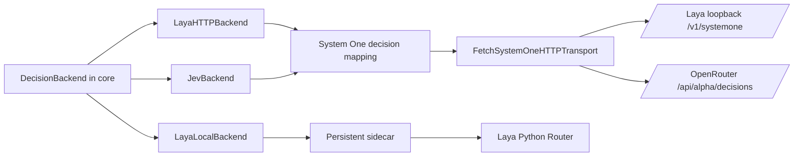

# Provider architecture and HTTP adapters (Steps 4–8)

`@thinktrim/providers` converts between the host-neutral `DecisionBackend` contract and concrete provider APIs. It does not choose decision outcomes or confidence thresholds. `LayaLocalBackend`, `LayaHTTPBackend`, and `JevBackend` are implemented adapters.

## Verified protocol overlap

- TypeSafe's [OpenAPI schema](https://api.typesafe.ai/openapi.json) defines `POST /v1/systemone` with `state`, `model`, and named `questions`; the response has named `answers`, `model`, and `usage`. Question types are `noul`, `choice`, and `score`; there is no native ranking question.
- OpenRouter's [Decisions API](https://openrouter.ai/docs/api/api-reference/alphadecisions/submit-a-decisions-request) accepts the same typed request/response shape at `POST /api/alpha/decisions`. Jev uses that endpoint with model `typesafe/jev-1.13`.
- Laya's [HTTP server](https://github.com/NandhaKishorM/laya/blob/main/laya/serve.py) implements the Jev-compatible `/v1/systemone` wire shape. Its official [HTTP serving guide](https://nandhakishorm.github.io/laya/docker/) documents `/health` and `/v1/systemone`; health is unauthenticated and an optional `LAYA_API_KEY` protects inference.

This overlap justifies sharing request/response serialization and typed decision mapping. Endpoints, authentication, model selection, retries, and locality remain provider-specific.

## Boundaries

`FetchSystemOneHTTPTransport` handles JSON serialization, bounded response reading, parsing, cancellation, and deadlines. `system-one-decision.ts` builds provider-neutral questions, validates answer names/types and usage, maps stable candidate IDs, and converts token usage. Jev and Laya HTTP keep endpoint selection, headers, model naming, locality, and retry behavior in their own adapters.

`LayaHTTPBackend` accepts only loopback HTTP(S) URLs because it advertises local processing. It uses `/health` and `/v1/systemone`, defaults to `http://127.0.0.1:8000`, reads `LAYA_API_KEY` when no key option is given, and leaves model selection to the server by default. Redirects are rejected by the shared transport. Jev is remote and requires both `remote_allowed` locality and permission for each data class before sending.

Local inference concurrency is bounded per adapter. `LayaLocalBackend` owns one persistent sidecar worker, serializes inference, and accepts at most 32 queued calls by default. Concurrent same-kind `predict()` calls are automatically coalesced into ordered sidecar `predictBatch` operations with at most 16 decisions each; callers can also use `predictBatch()` directly. Each response is validated before the batch is returned, and cancellation remains per decision while a shared inference is in progress. `LayaHTTPBackend` defaults to one active request and 32 queued requests; hosts may tune these through `maxConcurrentRequests` and `maxQueuedRequests`. Both local adapters expose queue and inference timing counters; the sidecar adapter also reports batch sizes. These counters are process-local diagnostics, not telemetry uploads.

The Step 19 baseline used 24 concurrent `LayaLocalBackend.predict()` calls against a mocked sidecar with a fixed 12 ms inference delay. Across three runs, total time was 398–414 ms; median request latency was 197–214 ms, p95 was 384–398 ms, and observed inference concurrency stayed at one. After automatic batching, the same 24 decisions were sent as groups of 16 and 8 and took 36.8 ms in a mock with a fixed 12 ms delay per batch operation. This confirms bounded dispatch, ordering, and metrics only; it does not estimate real model throughput because the mock assigns no additional compute cost to larger batches. Real CPU/GPU batching remains to be benchmarked with a loaded Laya model.

## Decision mapping

- Binary requests use `noul`; the adapter maps `noul >= 0.5` to a boolean while preserving the raw probability. This is a representation mapping, not confidence policy.
- Choice requests use stable candidate IDs and descriptions; provider output must select one of the supplied IDs and include a valid probability map.
- Core score means one score per candidate; System One score rates one state against an ordered rubric. The adapter uses a three-level rubric for each candidate and normalizes `[0, 2]` to `[0, 1]`.
- Ranking has no native System One question and is not advertised by any of these adapters.

The live Jev integration test runs only when `OPENROUTER_API_KEY` is present. The local HTTP backend and its protocol use no GPU requirement. Weights are not bundled in npm packages or the VS Code extension.
