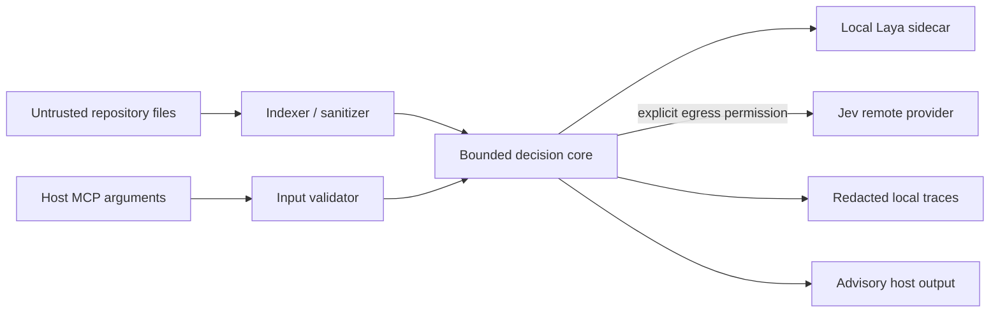

# Security and privacy model

Status: threat model for V1. The default operating posture is local, minimal, and fail-open for agent availability while remaining fail-closed for data egress and side-effecting actions.

The implemented Step 32 review, fixes, test evidence, and residual risks are recorded in `docs/SECURITY_AUDIT.md`.

## Trust boundaries

Repository text, logs, filenames, MCP arguments, backend output, and project configuration are untrusted. The host's user intent and ThinkTrim's own configured policy control actions. A model response never grants permission to read outside the workspace, exfiltrate source, run a command, execute tests, or retry a side-effecting operation.

## Controls

| Threat                           | Required control                                                                                                                                                                                                                                                                       |
| -------------------------------- | -------------------------------------------------------------------------------------------------------------------------------------------------------------------------------------------------------------------------------------------------------------------------------------- |
| Prompt injection in source/logs  | Treat all retrieved text as data; use bounded structured fields; never parse text as setup instructions or tool commands.                                                                                                                                                              |
| Path traversal and symlinks      | Canonicalize root and target, verify containment after symlink resolution, reject cross-root reads unless explicitly approved; guard against TOCTOU where practical.                                                                                                                   |
| Binary/oversized/sensitive files | Exclude binaries, generated and ignored files, secrets by pattern, and large payloads by default; cap bytes and candidate counts before provider calls. Explicit references do not bypass safety exclusions.                                                                           |
| Remote source leakage            | Local-only default. Jev requires a clear opt-in for repository-derived metadata/snippets, a preview of data classes, and a request-level locality check. Never silently fail over from local to remote.                                                                                |
| Credential leakage               | Obtain secrets from secure host storage or a supported credential provider; never place values in logs, traces, CLI arguments, ordinary settings, or setup previews. Redact auth headers and provider errors.                                                                          |
| MCP misuse                       | Validate schemas, workspace roots, deadlines, and output size; expose advisory read-only tools in V1. Keep stdout protocol-clean and diagnostics on stderr.                                                                                                                            |
| Command/config injection         | Installer edits structured host configuration using parsers and owned keys, never string-built shell commands. Preview, backup, atomic replace, post-write validation, and reversible uninstall.                                                                                       |
| Cache poisoning/staleness        | Namespace by canonical workspace and user context; include content and policy fingerprints; verify cache schema and expiry; store no raw secrets.                                                                                                                                      |
| Unsafe retries                   | `RetryPolicy` applies attempt, failure class, operation type, idempotency, and side-effect guards before inference. Destructive, high-risk, and unproven-idempotent operations cannot be retried automatically. The policy returns a recommendation only and cannot perform the retry. |
| Sidecar abuse                    | Run as the invoking user, bind local IPC only, cap message size/concurrency, authenticate local connection if exposed beyond inherited pipes, and stop cleanly. Do not execute repository code.                                                                                        |
| Telemetry leakage                | Local redacted metadata by default; no repository source or task text in events. Export is explicit and separately configured.                                                                                                                                                         |

The local trace writer uses an allowlist of fixed labels and numeric fields. It drops free-form request IDs, task/source/path text, backend model strings, error messages, reason codes, and stage outcomes; unknown category/backend/usage labels become `other`. It writes beneath the workspace's `.thinktrim/traces/` directory, which is Git-ignored. There is no network exporter in the telemetry package. Local file confidentiality follows OS permissions and the workspace ACL.

## Provider and privacy modes

`local_only` means all inference stays on the machine and routing cannot choose Jev. `remote_allowed` permits only the configured remote backend and specified data classes; a backend's reported locality must match its actual transport. A local sidecar may need model download during installation, but model acquisition is separate from prediction egress and must be disclosed. No model weights are packaged in npm or VSIX artifacts.

Provider responses are validated against decision schemas before they influence selection. Timeouts, crashes, invalid output, and cancellation become typed failures and then a conservative bypass or a different explicitly allowed backend. A fallback must never suppress files, block normal host operation, or create an automatic retry.

## Verification gates for implementation

Before release, test malicious paths/symlinks, injected repository text, oversized input/output, malformed backend output, secret redaction, local-only failover, installer rollback, and config merge/uninstall. Record the exact host/provider API versions and security assumptions in the implementation ADR or release notes when those integrations are built.
